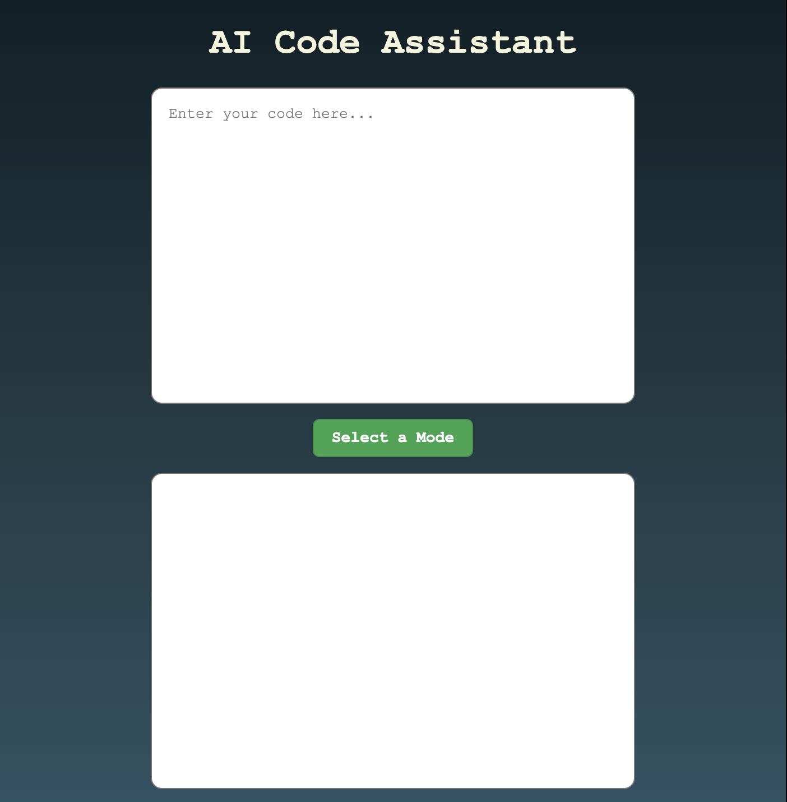
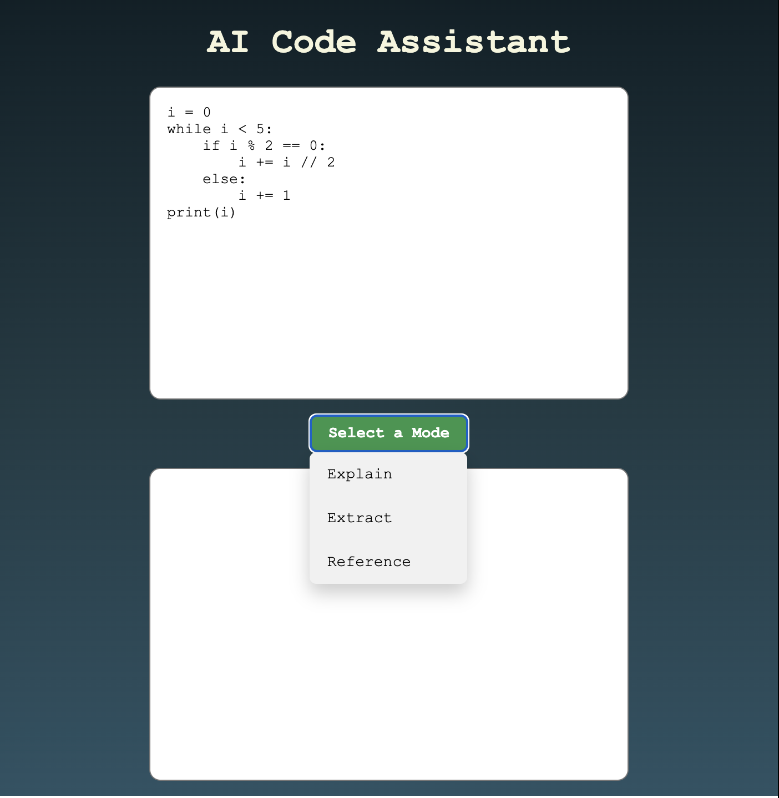

# coding-assistant

A web-application that allows users to input code and get an explanation, extract assumptions, and generate reference and confidence level of explanation of that code using GPT.

# How to use it
The web page is not deployed, on your local, you have to open the html manually on a web browser.
Below is a screenshot of the webpage:

Enter the code and select one of the modes:

